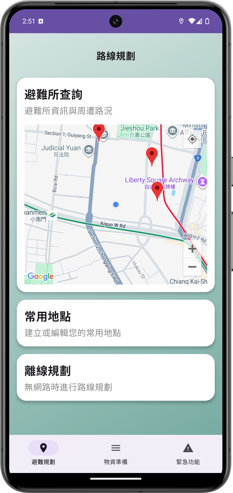
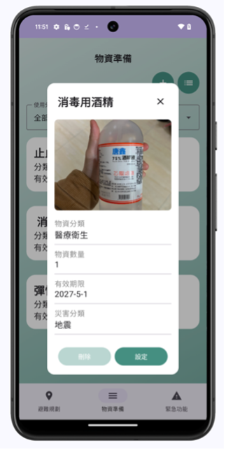
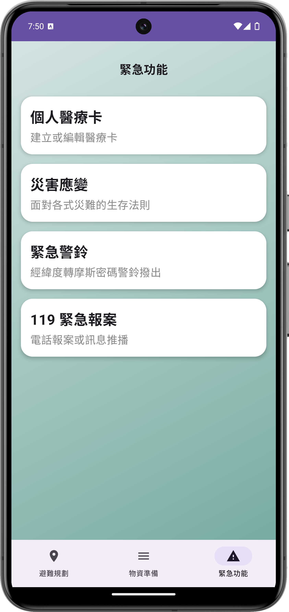

# 🏝️ Island Disaster Survival Guide
### 海島災害生存指南

> **NSTC-Funded Undergraduate Research Project (2024–2025)**  
> Project No. 113-2813-C-845-028-M  
> 🏆 People's Choice Award — University of Taipei CS Project Competition

A native Android app built for survival in extreme disaster scenarios — 
designed to function without internet or GPS connectivity.

[](https://developer.android.com)
[](https://kotlinlang.org)
[](https://developer.android.com/jetpack/compose)

---

## Background

Taiwan sits on the Pacific Ring of Fire and faces frequent earthquakes, 
typhoons, and flooding. Existing disaster apps rely on network connectivity 
for information retrieval — but in extreme scenarios where cell towers fail, 
users lose access to critical survival data.

This project addresses that gap with an **offline-first** approach: 
integrating cached map data, on-device sensors, and local storage to deliver 
navigation and survival support with **zero network dependency**.

---

## Key Features

### 🧭 Offline Evacuation Navigation
For network-down scenarios, built a dead-reckoning navigation system 
entirely from phone hardware:

- **Step detection** via accelerometer (G-Sensor) with a 
  Moving Average Filter to reduce noise from hand tremors
- **Bearing calculation** using the phone's magnetometer (electronic compass)
- **Distance estimation** using the Haversine formula 
  (spherical trigonometry) to compute geodesic distance between coordinates
- Designed future optimization path: A* algorithm + 
  Manhattan distance for indoor routing

### 🗺️ Shelter Search & Map Integration
- Google Maps Platform API displaying nearest shelters 
  (capacity, applicable disaster types)
- Room Database caching of user-defined "frequent locations" 
  (home, school, office) — accessible offline as evacuation reference points

### 🎒 Disaster Supply Management
- Photo-based inventory with category tagging and quantity tracking
- Expiration date monitoring with alerts
- Household-specific supply recommendations 
  (infants, elderly, pets, diabetic members)

### 🆘 Emergency Response Module
- **Morse code alarm**: converts current GPS coordinates to Morse code, 
  broadcast via speaker and flashlight — designed for 
  collapsed-building rescue scenarios
- **One-tap emergency**: integrates Android SmsManager and call intent 
  for 119 emergency dispatch with GPS location push
- **Personal medical card**: stores blood type, allergies, 
  and emergency contacts for first responders

---

## User Research

Developed alongside a structured quantitative survey (n=72) to 
validate feature priorities before implementation:

| Feature | Weighted Score | Rank |
|---|---|---|
| Offline navigation | 2.58 | #1 |
| Emergency rescue system | 2.43 | #2 |
| Shelter information query | 2.36 | #3 |
| Supply preparation & management | 2.26 | #4 |

Statistical methods: Friedman test (feature priority ranking), 
independent-sample t-test (age group differences in disaster preparedness).

Key finding: disaster preparedness awareness showed significant age-group 
variation (p < 0.001), informing the app's accessibility-focused UI design.

---

## Screenshots

| Evacuation Planning | Supply Management | Emergency Functions |
|---|---|---|
|  |  |  |

---

## Tech Stack

| Layer | Details |
|---|---|
| Language | Kotlin |
| UI | Jetpack Compose (Material Design 3) |
| Architecture | MVVM |
| Local Storage | Room Database (SQLite), DataStore |
| Sensors | Accelerometer, Magnetometer (SensorManager) |
| Maps | Google Maps SDK for Android |
| Build | Gradle with Version Catalog |

---

## Getting Started

API keys are excluded from this repository for security. 
To run the project locally:

**1. Clone the repository**
```bash
git clone https://github.com/AinsleeWang/Island-Disaster-Survival-App.git
```

**2. Configure API key**  
Create `local.properties` in the project root:
sdk.dir=/Users/yourname/Library/Android/sdk MAPS_API_KEY=YOUR_GOOGLE_MAPS_API_KEY


**3. Build and run**  
Open in Android Studio, sync Gradle, 
and deploy to an emulator or physical device.

---

## Development Note

> This project was developed as part of an NSTC-funded undergraduate 
> research program by a solo developer simultaneously managing 
> research design, user surveys, statistical analysis, and app development.
>
> The codebase reflects a **working research prototype** 
> rather than production-ready code. Known areas for improvement 
> are tracked in the Issues tab. A backend migration to 
> GCP (Cloud Firestore + Cloud Functions) is currently planned.

---

## Research Paper

Full research report (Chinese): 
[Google Drive](https://drive.google.com/file/d/1Ck1Woiun-QM3Z_x3FFoMjlvVCwkGwtp4/view?usp=share_link)

---

**Developed by [I-Ting Wang (Wit)](https://github.com/AinsleeWang)**  
[LinkedIn](https://www.linkedin.com/in/i-ting-wang-34b808348) · 
[Portfolio](https://quartz-science-428.notion.site/I-Ting-Wang-Ainslee-344e7ae2f3b78064b427f211db322e6f?source=copy_link) 